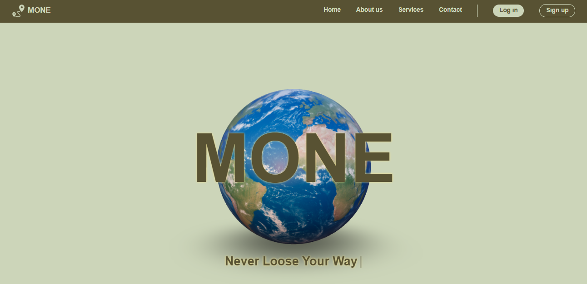
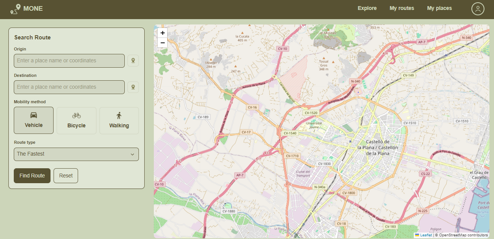
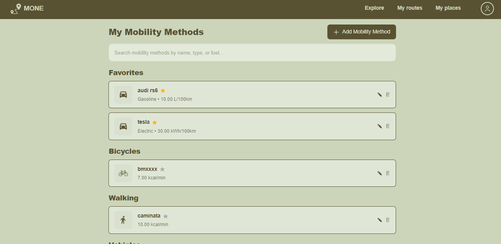
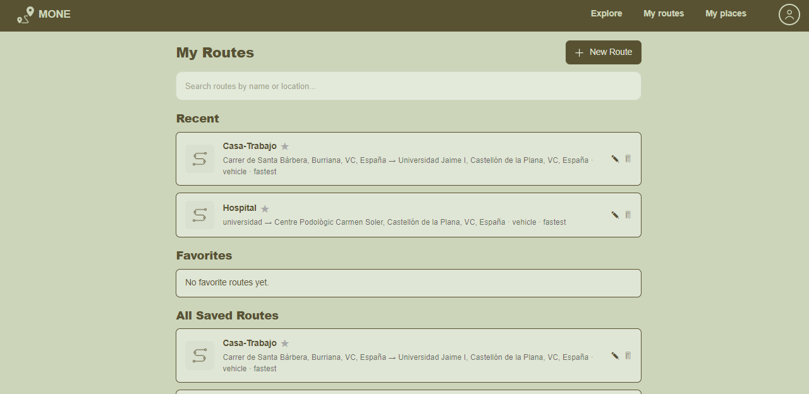

# MONE · Monitorización y Optimización de Energía ⚡

## 1. Introducción
MONE es una plataforma web que ayuda a los usuarios a gestionar sus lugares frecuentes, configurar vehículos y planificar rutas reales con información de costes, distancias y tiempos. La demo pública está desplegada en Vercel: https://moneetravel.vercel.app/ . El objetivo es integrar autenticación, persistencia y cálculo de rutas en un flujo accesible y seguro respaldado por CI/CD en GitHub Actions.

(⚠️ Ciertas operaciones de rutas fallan ahí por restricciones de la API de OpenRouteService; en local funcionan correctamente). 

## 2. Contexto académico 🎓
- **Universidad:** Universitat Jaume I (UJI)
- **Grado:** Ingeniería Informática
- **Asignatura/Iteración:** Diseño del Software · Paradigmas del Software
- **Curso:** 2025‑2026

## 3. Tecnologías y herramientas
- **Frontend:** React 19.2.0, TypeScript, Vite, TailwindCSS
- **Servicios:** Firebase Auth & Firestore, OpenRouteService API
- **Testing:** Vitest + Testing Library (tests de aceptación e integración)
- **Gestión:** GitHub Projects/Kanban

## 4. Estructura del proyecto
- `src/` – núcleo de la aplicación
  - `view/` componentes y páginas (Home, Route, Place, User, Vehicle)
  - `domain/` modelos, servicios, repositorios, proxys, factory, facade y decoradores
  - `data/` adapters (Firebase, OpenRouteService), mappers y proveedores
  - `core/` configuración de Firebase y contextos de autenticación
  - `assets/`, `styles/` – recursos gráficos y hojas CSS
- `tests/` – carpetas `it-0X` con suites de aceptación/integración por cada iteración
- `public/` y `resources/` – assets estáticos (logo, modelo tierra 3D, texturas)
- Configuración raíz: `vite.config.ts`, `tsconfig*.json`, `package.json`, `README.md`

## 5. Funcionalidades principales
- Registro, login y gestión de sesión con Firebase y caché local.
- Guardado, edición, eliminación y consulta de lugares con cacheo offline.
- Sugerencias toponímicas y reverse geocoding usando OpenRouteService.
- Configuración de vehículos, preferencias energéticas y opciones por defecto.
- Gestión: GitHub Projects/Kanban, CI/CD con GitHub Actions, Despliegue en Vercel
- Dashboard responsive con menús contextuales (HomeNavBar/AppNav) y logout seguro.

## 6. Ejemplos y capturas 📸
- **Figura 1:** Vista Home

- **Figura 2:** Panel para buscar rutas 

- **Figura 3:** Personalizaciones

-  **Figura 4:** Trayectos guardados:

## 7. Posibles futuras mejoras
- Adaptación a otros idiomas (ES/VAL).
- Panel analítico comparando hábitos de movilidad del usuario.

## 8. Instalación y ejecución 🚀
1. Clonar el repositorio.
2. Instalar dependencias: `npm install`.
3. Crear `.env` con:
  - `VITE_FIREBASE_API_KEY`, `VITE_FIREBASE_AUTH_DOMAIN`, ...
  - `VITE_ORS_API_KEY` y opcionalmente `VITE_ORS_BASE_URL`.
4. Servidor de desarrollo: `npm run dev` → http://localhost:5173.
5. Probar suites: `npm run vitest` (o `npx vitest --ui`).
6. Build final: `npm run build`.

## 9. Autores y créditos 🙌
- Ernesto Vilalta Guerrero
- Teresa Barzano Aicart
- Haytame El Harhari Annour

